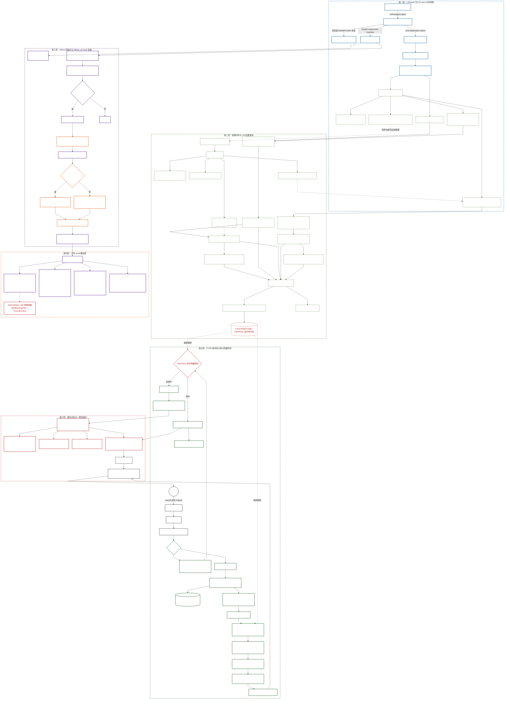

```mermaid
%%{init: {'flowchart': { 'curve': 'linear', 'nodeSpacing': 28, 'rankSpacing': 44 }}}%%
flowchart TD
    classDef default fill:none,stroke:#555,stroke-width:2px,color:#ffffff;
    classDef inject fill:none,stroke:#01579b,stroke-width:2px;
    classDef config fill:none,stroke:#33691e,stroke-dasharray: 5 5;
    classDef native fill:none,stroke:#4a148c,stroke-width:2px;
    classDef elf fill:none,stroke:#e65100,stroke-width:2px;
    classDef policy fill:none,stroke:#b71c1c,stroke-width:2px,color:#b71c1c;
    classDef cachetext fill:none,stroke:#b71c1c,stroke-width:2px,color:#ffffff;
    classDef fuse fill:none,stroke:#1b5e20,stroke-width:2px;
    classDef os fill:none,stroke:#424242,stroke-width:2px,color:#ffffff;

    subgraph Phase1 ["第一层：LSPosed 注入与 Java 生命周期"]
        direction TB
        LSP["LSPosed / LibXposed"] -->|onPackageLoaded| Entry["Entry.onPackageLoaded"]
        Entry -->|仅匹配 MediaProvider 包名| MP["MediaProvider 进程"]
        Entry -->|System.loadLibrary fusehide| LoadSo["libfusehide.so"]
        Entry -->|hook Application.attach| AttachHook["Application.attach"]
        AttachHook --> App["捕获真实 Application"]
        App --> MainTask["MainThreadTask / registerStatusReceiver"]
        MainTask --> ReceiverHub["注册 Receiver 集合"]
        ReceiverHub --> StatusRx["StatusBroadcastReceiver\n状态探测"]
        ReceiverHub --> ReloadRx["ACTION_RELOAD_HIDE_CONFIG\n配置重载 Receiver"]
        ReceiverHub --> QueryRx["ACTION_GET_APPLIED_HIDE_CONFIG\n已应用配置查询 Receiver"]
        ReceiverHub --> BootRx["BOOT / LOCKED_BOOT / USER_UNLOCKED\n重试触发 Receiver"]
        MainTask --> InitReload["startConfigReload initial"]
    end
    class LSP,Entry,MP,LoadSo,AttachHook,App,MainTask inject;
    class ReceiverHub,StatusRx,ReloadRx,QueryRx,BootRx,InitReload config;

    subgraph Phase2 ["第二层：配置同步与 JNI 配置落地"]
        direction TB
        UI["App UI / HideConfigStore"] --> ConfigPublish["配置发布端"]
        ConfigPublish --> SharedPrefs["设备保护存储 / SharedPreferences"]
        ConfigPublish --> Provider["HideConfigProvider\nget_hide_config"]
        ConfigPublish --> RequestRx["HideConfigRequestReceiver"]
        ConfigPublish --> ReloadBc["ACTION_RELOAD_HIDE_CONFIG"]

        InitReload --> ReloadFlow["启动 / 开机重试\nreloadInjectedProcessConfig"]
        BootRx --> ReloadFlow
        ReloadFlow --> Snapshot["先加载 injected process snapshot"]
        Snapshot --> ProviderTry["再尝试 HideConfigProvider"]
        ProviderTry --> FallbackReq["失败则 ACTION_REQUEST_HIDE_CONFIG"]
        FallbackReq --> ApplyBundle["applyBundleToNative"]
        Snapshot --> ApplyBundle
        ProviderTry --> ApplyBundle
        ReloadRx --> ReloadDirect["显式重载路径\nprovider + token check + fallback"]
        ReloadDirect --> ProviderTryDirect["优先读取 HideConfigProvider"]
        ProviderTryDirect --> FallbackDirect["token 不匹配或 provider 失败\nACTION_REQUEST_HIDE_CONFIG"]
        ProviderTryDirect --> ApplyBundle
        FallbackDirect --> ApplyBundle
        ApplyBundle --> JNIApply["HideConfigNativeBridge.applyHideConfig"]
        JNIApply --> ConfigMem[("CurrentHideConfig / PathPolicy 运行时内存")]
        ApplyBundle --> SaveSnapshot["保存最新 snapshot"]
    end
    class UI,ConfigPublish,SharedPrefs,Provider,RequestRx,ReloadBc,ReloadFlow,ReloadDirect,Snapshot,ProviderTry,ProviderTryDirect,FallbackReq,FallbackDirect,ApplyBundle,JNIApply,ConfigMem,SaveSnapshot config;

    subgraph Phase3 ["第三层：Native 初始化与 libfuse_jni hook 安装"]
        direction TB
        LoadSo --> JniOnLoad["JNI_OnLoad\n仅保存 JavaVM"]
        LoadSo --> NativeInit["native_init / LSPosed native callback"]
        NativeInit --> PostInit["PostNativeInit loadedLibrary"]
        PostInit --> CheckTarget{"是否为 libfuse_jni.so"}
        CheckTarget -->|是| Install["InstallFuseHooks"]
        CheckTarget -->|否| Ignore["忽略"]

        Install --> Maps["FindTargetModule / proc self maps"]
        Maps --> Status["RefreshCoreHookStatus"]
        Status --> FilePath{"文件路径可直接解析"}
        FilePath -->|是| FileElf["BuildFileElfContext\n最小 file backed hook 路径"]
        FilePath -->|否| RuntimeElf["embedded apex 场景\nadvanced runtime ELF fallback"]
        FileElf --> Advanced["InstallAdvancedCoreHooks"]
        RuntimeElf --> Advanced
        Advanced --> Inline["Inline hook / relocation patch"]
    end
    class JniOnLoad,NativeInit,PostInit,CheckTarget,Install,Status,Inline native;
    class Maps,FilePath,FileElf,RuntimeElf,Advanced elf;
    class Ignore native;

    subgraph Phase4 ["第四层：实际 hook 覆盖面"]
        direction TB
        Inline --> HookSet["安装 hook 集合"]
        HookSet --> AccessHooks["路径与缓存策略 hook\nisAppAccessiblePath / isPackageOwnedPath\nisBpfBackingPath / shouldNotCache"]
        HookSet --> FuseHooks["FUSE 入口 hook\npf_lookup / pf_lookup_postfilter / pf_getattr\npf_readdir / pf_readdir_postfilter / pf_readdirplus\ndo_readdir_common"]
        HookSet --> ReplyHooks["reply 与失效 hook\nfuse_reply_entry / fuse_reply_attr / fuse_reply_buf / fuse_reply_err\nnotify_inval_entry / notify_inval_inode"]
        HookSet --> FallbackHooks["lower fs 与 libc fallback hook\nGetDirectoryEntries / addDirectoryEntriesFromLowerFs\nstat / lstat / getxattr / open / mkdir / mknod 等"]
        AccessHooks -.-> AndroidSpecial["Android/data / obb 特殊链路\nisBpfBackingPath + Unicode policy"]
    end
    class HookSet,AccessHooks,FuseHooks,ReplyHooks,FallbackHooks native;
    class AndroidSpecial policy;

    subgraph Phase5 ["第五层：FUSE 请求执行链与隐藏判定"]
        direction TB
        Caller(("受限 App")) -->|syscall 访问 /sdcard| VFS["Kernel VFS"]
        VFS --> DevFuse["/dev/fuse"]
        DevFuse --> Worker["libfuse_jni worker thread"]

        Worker --> RequestGate{"请求类型"}
        RequestGate --> LookupPath["lookup / getattr / create / delete / rename\n先走路径策略判定"]
        RequestGate --> ReaddirPath["readdir 家族请求"]

        LookupPath --> PolicyCheck{"PathPolicy 命中隐藏规则"}
        PolicyCheck -->|命中| Deny["返回 ENOENT / 拦截结果"]
        PolicyCheck -->|未命中| NativePass1["放行原始逻辑"]

        ReaddirPath --> SaveCtx["记录 req unique / uid / ino / parent path"]
        SaveCtx --> PendingQ[("gPendingReaddirContexts\ntracked inode path 状态")]
        SaveCtx --> NativeReaddir["调用原始 do_readdir_common / readdir 路径"]
        NativeReaddir --> ReplyBuf["WrappedReplyBuf"]

        ReplyBuf --> ContextRecover["恢复 uid / ino / parent path\n必要时回退到 recent hidden parent"]
        ConfigMem -.->|提供规则| PolicyCheck
        ConfigMem -.->|提供规则| ContextRecover
        ContextRecover --> FilterPayload["FilterReplyBufPayload\n识别 readdir / readdirplus / postfilter payload"]
        FilterPayload --> ParseDirent["解析 fuse_dirent / direntplus 布局"]
        ParseDirent --> Rewrite["移除命中项并重写 buffer / size"]
        Rewrite --> NativePass2["调用原始 fuse_reply_buf"]
        Deny --> ReplyErr["fuse_reply_err / 拒绝结果"]
        NativePass1 --> ReplyEntryAttr["fuse_reply_entry / fuse_reply_attr"]
    end
    class Caller,VFS,DevFuse,Worker os;
    class RequestGate,LookupPath,ReaddirPath,SaveCtx,PendingQ,NativeReaddir,ReplyBuf,ContextRecover,FilterPayload,ParseDirent,Rewrite,NativePass1,NativePass2,Deny,ReplyErr,ReplyEntryAttr fuse;
    class PolicyCheck,ConfigMem policy;

    subgraph Phase6 ["第六层：缓存对抗与一致性维护"]
        direction TB
        CacheHub["缓存对抗手段集合\n面向共享 FUSE/VFS 缓存 跨 UID 泄漏"] --> CacheEntry["WrappedReplyEntry\n命中隐藏子树时强制 entry_timeout=0\nattr_timeout=0"]
        CacheHub --> CacheAttr["WrappedReplyAttr\n需要时强制 attr timeout=0"]
        CacheHub --> ShouldNotCache["WrappedShouldNotCache\n阻断缓存命中"]
        CacheHub --> ScheduleInvalidate["ScheduleHiddenEntryInvalidation\nScheduleSpecificEntryInvalidation\nScheduleHiddenInodeInvalidation"]
        ReplyEntryAttr --> CacheHub
        Deny --> ScheduleInvalidate
        ScheduleInvalidate --> InvalHooks
        InvalHooks --> CacheState["dentry / inode / FUSE 共享缓存尽快失效"]
        NativePass2 --> CacheState
        CacheState --> Caller
    end
    class CacheHub,CacheEntry,CacheAttr,ShouldNotCache,ScheduleInvalidate cachetext;
    class CacheState os;

    ReloadBc -.-> ReloadRx
    Provider -.-> ProviderTry
    QueryRx -.->|回传当前已应用配置| UI

    style Phase1 fill:none,stroke:#01579b,stroke-width:2px,stroke-dasharray: 5 5
    style Phase2 fill:none,stroke:#33691e,stroke-width:2px,stroke-dasharray: 5 5
    style Phase3 fill:none,stroke:#4a148c,stroke-width:2px,stroke-dasharray: 5 5
    style Phase4 fill:none,stroke:#e65100,stroke-width:2px,stroke-dasharray: 5 5
    style Phase5 fill:none,stroke:#1b5e20,stroke-width:2px,stroke-dasharray: 5 5
    style Phase6 fill:none,stroke:#b71c1c,stroke-width:2px,stroke-dasharray: 5 5
```
